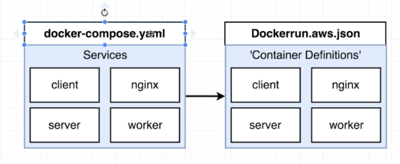
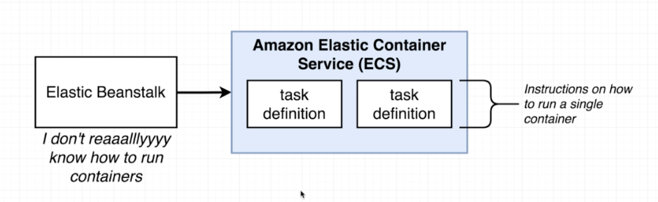

# Multi Container Docker Application

## What the ap does:
Calculating fibunacci numbers by it's index.
Therefore, there is a html page, where i can search for fibunacci numbers by it's index.
The page also stores indexes, that have been queried before.

## Architecture

### Docker architecture:
There will be multiple containers:
- postgres
- redis
- server
    - specify build
    - specify volumes
    - specify env variables (looking at `./server/keys.js`, there are some variables, that need to be passed in to the container!)
    
### Servers and Routing

 
#### Dev

#### Prod

 
To enable this routing, we need to configure Nginx. This will be done, by a file called `default.conf`.
 

 
Please note:
"api" is the name of the Express Server, but "client" is the name of the React Server.
In config, both do use same key word "server". 

### CI-Deployment Workflow

 
Attention: when performing an automated login against docker: PW should not contain special characters like: "! ? & ;"

#### docker-compose vs Dockerrun.aws.json

 
**compose:**
 
In compose, we build images on our own.
 
__aws:__
 
In aws, we pull images from [hub.docker.com](hub.docker.com)
When having multiple services, aws will use another service, to define tasks for each container.
This service is called *ECS*. When researching properties for aws-description, look [here](https://docs.aws.amazon.com/AWSCloudFormation/latest/UserGuide/aws-properties-ecs-taskdefinition-containerdefinitions.html).
 
The name of the file, which describes aws multi container behaviour is `Dockerrun.aws.json`:
 
Some notes:
- at least one container must be flagged with essential
- according to docker-compose, we need to define links between different containers
    - the name inside a link references the **name-tag**
- it makes sense to validate json file, before deploying it to aws 

