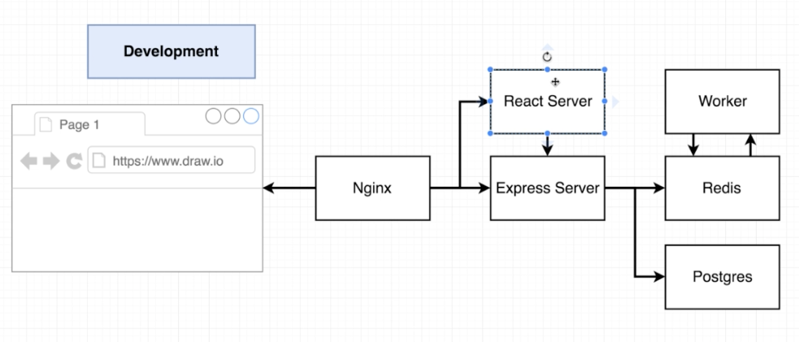
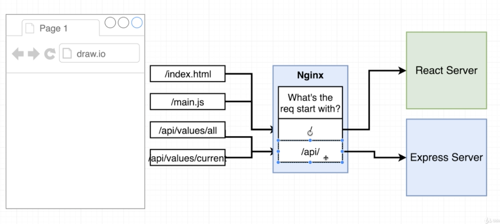
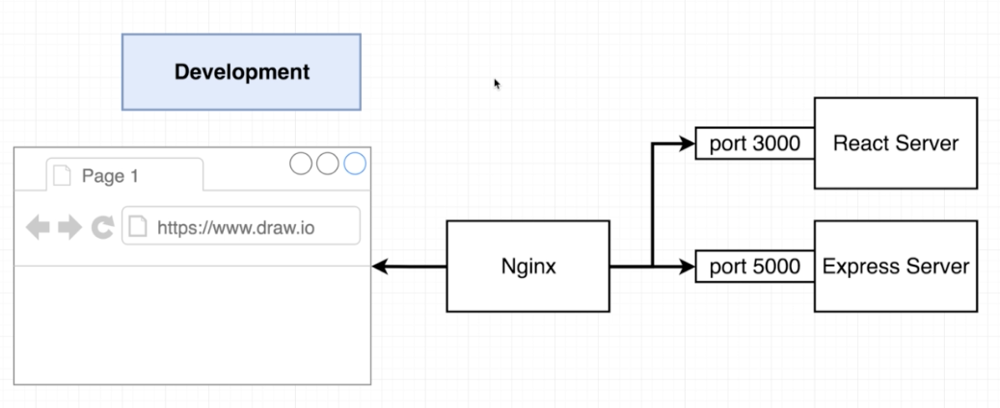
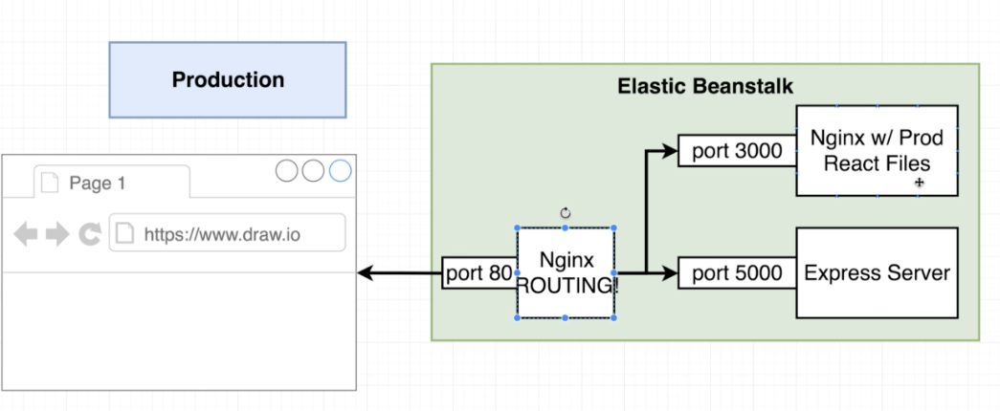
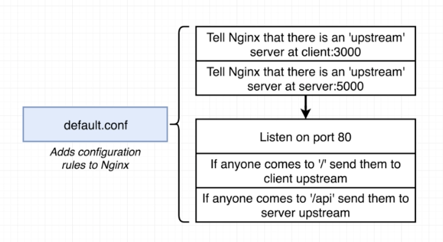
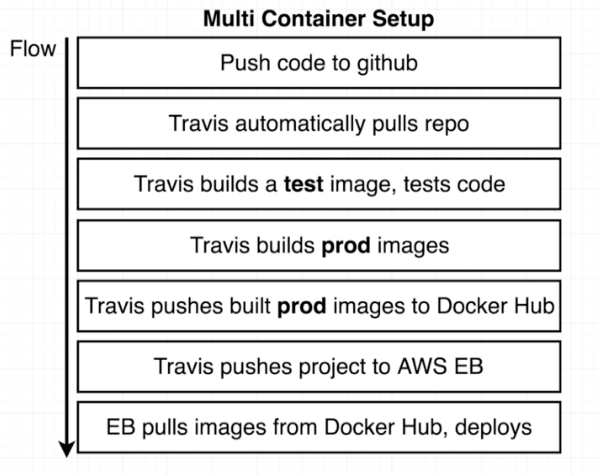

# Multi Container Docker Application

## What the ap does:
Calculating fibunacci numbers by it's index.
Therefore, there is a html page, where i can search for fibunacci numbers by it's index.
The page also stores indexes, that have been queried before.

## Architecture

### Docker architecture:
There will be multiple containers:
- postgres
- redis
- server
    - specify build
    - specify volumes
    - specify env variables (looking at `./server/keys.js`, there are some variables, that need to be passed in to the container!)
    
### Servers and Routing

 
#### Dev

#### Prod

 
To enable this routing, we need to configure Nginx. This will be done, by a file called `default.conf`.
 

 
Please note:
"api" is the name of the Express Server, but "client" is the name of the React Server.
In config, both do use same key word "server". 

### CI-Deployment Workflow

